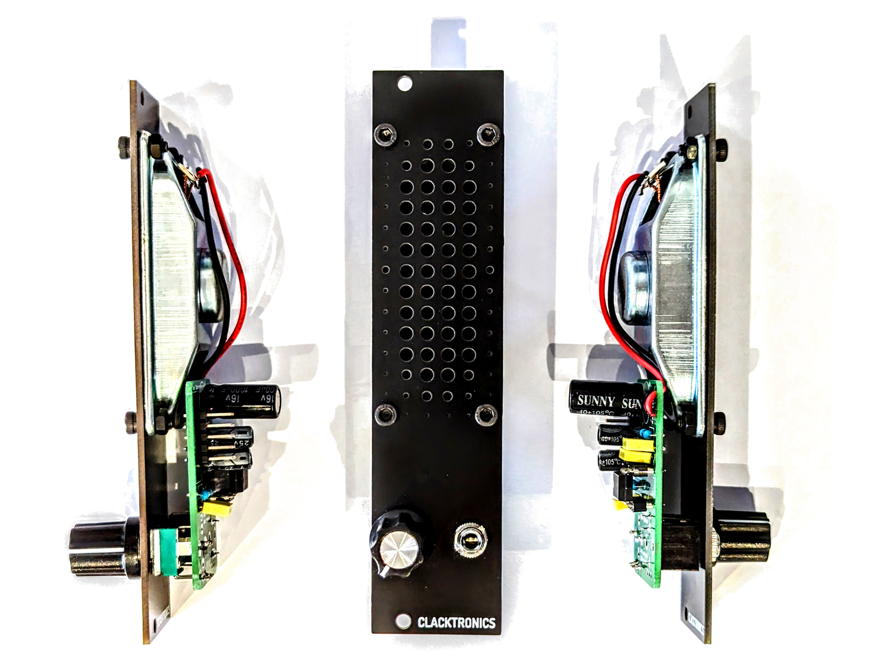

# Eurorack Speaker

Have you ever wanted to add a speaker to your Eurorack setup? Look no further than the [Clacktronics Eurorack Speaker Module!](https://www.thonk.co.uk/shop/clacktronics-speaker-kit/) Not only did I build one for my own setup, but I've also prepared the necessary files for others in the community to build their own.

## Why Add a Speaker to Your Eurorack?

There are a number of reasons why you might want to add a speaker to your Eurorack setup. Perhaps you want to be able to monitor your audio output without having to plug in headphones or connect to external speakers. Or maybe you want to use your Eurorack as a standalone instrument for performance or jam sessions.

Whatever your reasons may be, the Clacktronics Eurorack Speaker Module offers a simple and affordable solution.

## Building Your Own Clacktronics Eurorack Speaker Module

To enhance the Clacktronics Eurorack Speaker Module, I added a copper layer to stiffen the panel and improve its durability. Additionally, I have prepared the necessary gerber files that can be sent to a PCB manufacturer like JLCPCB to produce your own high-quality PCBs. These files are conveniently available on my GitHub repository [Azerty-Labs/Eurorack-Speaker](https://github.com/azerty-labs/Eurorack-Speaker). For reference to the original GitHub, please click here [Original GitHub](https://github.com/clacktronics/EuroClack_Speaker).

Once you have your PCB, you'll need to gather the necessary components. Here's what you'll need:

- 1x LM386N-4 audio amplifier IC
- 1x Dip-8 support
- 2x 10uF electrolytic capacitor
- 3x 100nF ceramic capacitors
- 1x 1000uF capacitor electrolytic
- 1x 470KΩ resistor
- 1x 10Ω resistor
- 1x 10k potentiometer (linear) 
- 1x knob cap
- 1x 8Ω speaker (3070, 8 ohm, 5 Watt)
- 1x 2x5 pin Eurorack power socket
- 1x 3.5mm mono audio jack (PJ398SM)

You can order these components from your preferred supplier. Once you have everything, you're ready to start assembling your module!

I won't go into the specifics of assembly here, but I recommend following the instructions on the Clacktronics [website](http://clacktronics.co.uk/euroclack/mini-speaker_kit/). They offer a detailed guide that will take you through each step of the process.

## Conclusion

Adding a speaker to your Eurorack setup can be a game-changer. With the Clacktronics Eurorack Speaker Module, you can do it easily and affordably. And with the gerbers files I've prepared, you can build your own module and join the growing community of DIY Eurorack enthusiasts.

Happy building!